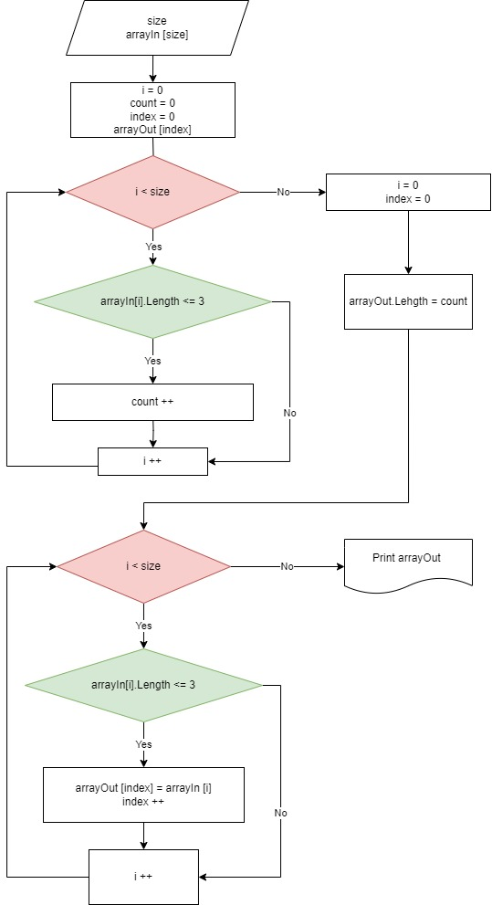

# Первая четверть - Итоговая работа

## **`Задача:`** 
Написать программу, которая из имеющегося массива строк формирует новый массив из строк, длина которых меньше, либо равна 3 символам. Первоначальный массив можно ввести с клавиатуры, либо задать на старте выполнения алгоритма. При решении не рекомендуется пользоваться коллекциями, лучше обойтись исключительно массивами.

## `Примеры:`

[“Hello”, “2”, “world”, “:-)”] → [“2”, “:-)”]

[“1234”, “1567”, “-2”, “computer science”] → [“-2”]

[“Russia”, “Denmark”, “Kazan”] → []

## `Описание решения:`

 1. Создаем входной массив длиной, введеной с клавиатуры
 2. Заполняем входной массив элементами, введенными с клавиатуры
 3. Создаем выходной массив:
 * Определяем длину выходного массива - пробегаем по входному массиву и проверяем условие (длина элемента должна быть меньше, либо равна 3 символам) - счетчик count
 * Если длина выходного массива равна 0, то на экран выводим сообщение о том, что элементов, удовлетворяющих условию, нет
 * Если же во входном массиве есть элементы, удовлетворяющие условию, создаем выходной массив длиной, соотвествующей счетчику
 4. Выводим на экран выходной массив

## `Блок-схема основного метода:`

